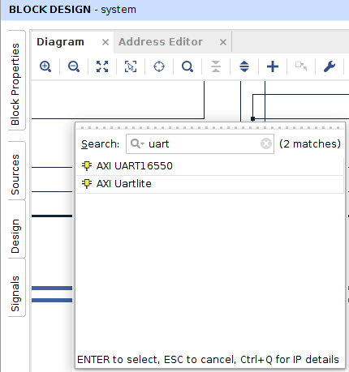
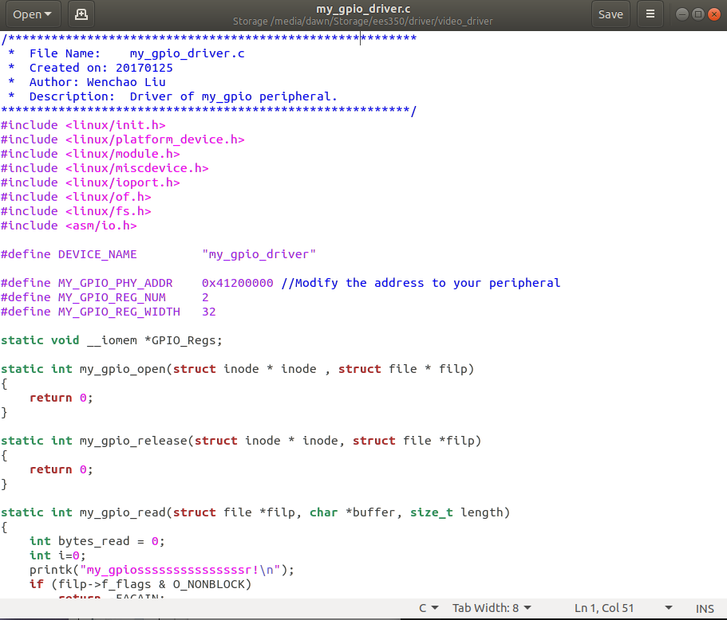
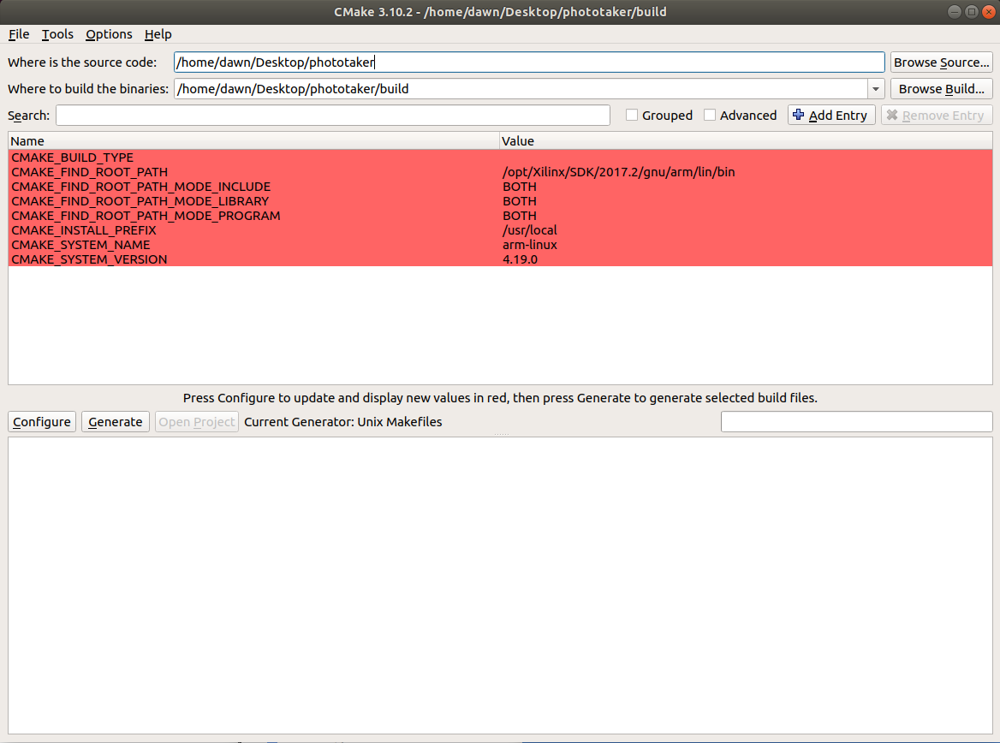

# <center>开发文档——硬件底层与外设</center>

>本开发文档基于Ubuntu环境下2017.2版Vivado，如按此教程在更加新的版本出现问题请到[Xilinx 技术支持网站](https://china.xilinx.com/support.html "With a Title")寻求帮助。

## （一）、Vivado工程中基本外设的添加

### 1.用于输出的GPIO（LEDBAR）

首先在Vivado工程中打开Block Design，点击Diagram窗口内部工具栏中的:heavy_plus_sign:按钮，搜索GPIO，点击AXI GPIO进行添加。
<div align=center>

</div>
双击添加之后的GPIO模块根据外设IO口进行配置如图。
<div align=center>

</div>
配置完成点击OK，然后点击Run Connection Automation进行自动连线。
至此添加完成。

### 2.用于输入的GPIO（寻线器）

与上述过程类似，只需更改GPIO的输入输出方式为All Inputs，并按外设类型设置位宽。

### 3.采用UART协议的外设（蓝牙）

在Vivado中搜索uart，选择AXI Uartlite模块。

<div align=center>

</div>

波特率设置为9600，Data Bits设置为8，Parity选择No Parity。
添加完成基本外设之后，利用Vivado进行综合，完成后按硬件文档分配引脚在进行实现和比特流的生成。

注意：Address Editor中的地址后面要用到。

## （二）、EES350系统移植

将生成比特流进行Export Hardware操作，打开SDK进行下一步操作。
系统移植需要四个基本模块如下：

- Vivado+SDK产生的BOOT.bin文件
- 编译内核产生的uImage文件
- 文件系统uramdisk或linaro
- 设备树devicetree.dtb文件

## （三）、外设驱动的编写、编译与加载

### 1.驱动的编写

对于GPIO外设，请根据图像组video_driver中的对$I^2C$进行操作的GPIO驱动进行修改。修改内容如下：

- 设备名称(DEVICE_NAME)：修改为自己定义的设备名称。
- 物理地址(MY_GPIO_PHT_ADDR):根据Vivado定义的设备地址进行修改。
- 寄存器数量与位宽：根据需要更改。

<div align=center>

</div>

### 2.驱动的编译

- source交叉编译环境：```source /opt/Xilinx/SDK/2017.2/settings64.sh```
- 编译命令：``` make ARCH=arm CROSS_COMPILE=arm-xilinx-linux-gnueabi-```

### 3.驱动的加载

加载驱动有两种方式，分别是手动加载和自动加载。

- 手动加载：将驱动文件放在ko文件夹中，利用串口调试工具连接小车，cd到ko文件夹下，利用```insmod driver_name.ko```指令加载驱动。
- 自动加载：根据启动自加载文档，在制作文件系统时将上述命令添加进```tmp_mnt/etc/init.d/rcS```文件中的倒数第二行。

驱动加载成功之后，利用串口调试工具cd到dev文件夹下利用ls命令可以看到先前编写驱动时的设备名称。

## （四）、外设的应用函数编写

### 1.设备初始化：Initial函数

以GPIO接口的LEDBAR控制为例：

```C++
int ledbar_init(void)
{
    my_ledbar_fd = open("/dev/my_ledbar_driver", 0);
    if(my_ledbar_fd<0)
    {
        printf("ledbar:[ERROR] Can't open device.");
        return 0;
    }	
    printf("ledbar: Open device. File description of my_ledbar is %d\n",my_ledbar_fd);

	return 1;
}
```

### 2.根据外设手册对io寄存器操作完成相应功能

以LEDBAR的CLK输入端拉高电平为例：

```C++
void C_HIGH(void)
{
	u32 Value=0x1;
	

	//temp = devmem('r',gpio_base_addr,0);
	rd_buf = ioctl(my_ledbar_fd, 0x80000000, 4);
	//rd32_buf = (int)temp[0] + ((int)temp[1]<<8) + ((int)temp[2]<<16) + ((int)temp[3]<<24);
	Value = rd_buf | Value;
	ioctl(my_ledbar_fd, 0, Value);
	//devmem('w',gpio_base_addr, Value);
}
```

## （五）、OpenCV的配置

[OpenCv配置教程](https://blog.csdn.net/brilliantdo/article/details/51417798 "With a Title")

## （六）、图像的读取

首先给出两个网页：[Opencv:Mat 和VDMA数据位数以及VGA数据位数的关系](https://blog.csdn.net/dengshuai_super/article/details/52468505 "With a Title")，[ZYNQ HLS图像处理加速总结(二)——Processing System软件部分](http://xilinx.eetrend.com/d6-xilinx/blog/2016-01/9704.html "With a Title")。
工程里的视频传输协议为VDMA方式，其基本思路为：从镜头采集图像传输到DDR，从DDR读取图像到HDMI显示，具体协议内容请参照VDMA手册。
对于图像组，我们可以从DDR中直接读取图像数据并存储到变量中，以便后续利用OpenCV处理。
读取图像需要解决的三个主要问题为

- 图像存放的地址
- 存储图像的数据结构
- 如何读出到变量

### 1.图像存放的地址

Demo程序中有如下定义：

```C++

#define DDR_BASEADDR 0x30000000
#define VIDEO_BASEADDR0 DDR_BASEADDR + 0x02000000
#define VIDEO_BASEADDR1 DDR_BASEADDR + 0x03000000
#define VIDEO_BASEADDR2 DDR_BASEADDR + 0x04000000
```

在移植到嵌入式的Linux系统中，我们如果想对硬件物理地址进行操作就必须将物理地址映射到Linux虚拟地址空间中，

```C++
void* mmap(void* start,size_t length,int prot,int flags,int fd,off_t offset);
```

- start：映射区的开始地址，设置为0时表示由系统决定映射区的起始地址。
- length：映射区的长度。//长度单位是 以字节为单位，不足一内存页按一内存页处理
- fd：有效的文件描述词。一般是由open()函数返回，其值也可以设置为-1，此时需要指定flags参数中的MAP_ANON,表明进行的是匿名映射。
- off_toffset：被映射对象内容的起点。

### 2.存储图像的数据结构

系统底层中VDMA图像数据流的格式为RGB888格式，利用OpenCV中的Mat结构体对图像进行存储是最佳方式。
在移植完成OpenCV后，可以按照如下方式初始化Mat用于存储RGB888格式的图像。

```C++
cv::Mat dst_rgb(720, 1280, CV_8UC3);
```

注：OpenCV默认数据存储格式为BGR，利用Mat读进来的图像数据中，R通道和B通道的内容存放位置是错误的，可以利用下述函数对颜色通道进行转换。

```C++
cv::cvtColor(dst_rgb, dst_bgr,COLOR_RGB2BGR);
```

### 3.读出到变量

头文件string.h中定义的memcpy函数可以将数据从源地址（1中映射后的虚拟地址）复制到指定地址（Mat数组的指针起始地址）。

```C++
void *memcpy(void *dest, const void *src, size_t n);
```

## （七）、功能的整合与函数编译

完成底层的搭建，外设驱动和应用程序的编写以及图像读取之后，即可在此基础上进行应用开发。开发必定需要多个C文件的链接和交叉编译，我们组利用CMAKE工具生成Makefile，然后进行交叉编译。
首先需要安装cmake工具及其依赖环境（百度有很多相关教程），并安装cmake-gui工具在UI界面操作省去不必要的繁琐。

<div align=center>

</div>

安装完成后在终端输入cmake-gui启动，修改source code地址和build地址为源代码存放位置和Makefile生成位置，在源文件目录中新建CMakeLists.txt，对指定编译方式、编译器路径、头文件路径和动态链接库路径。具体内容需要根据工程来确定，cmake的介绍和详细语法还是参考[官方文档](http://www.cmake.org "With a Title")，有一篇中文的cmake实践写的不错，可以google一下。

编译完成即可将生成的可执行文件、系统移植所需的四个文件和驱动文件放入SD卡中，设置好开发板的启动方式为SD卡启动，使用串口调试工具cd到mnt目录下，利用命令./（你的可执行文件名）来执行。
